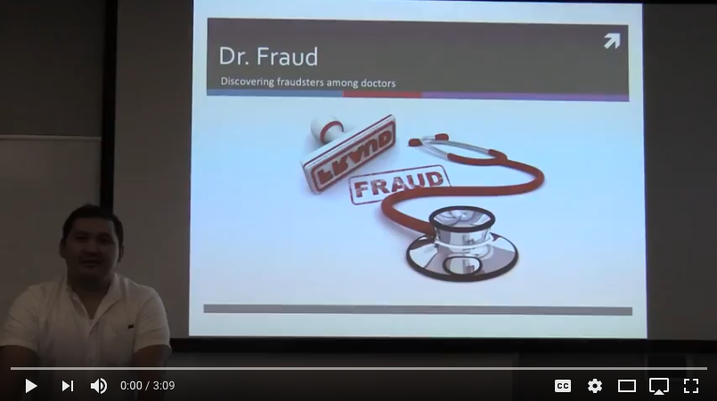
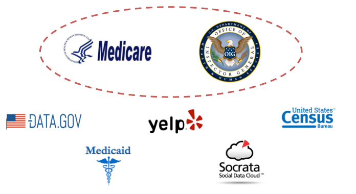
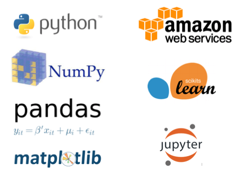
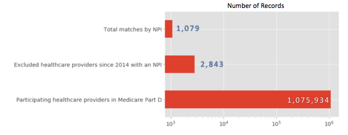
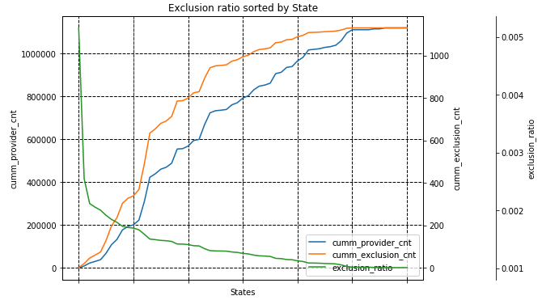
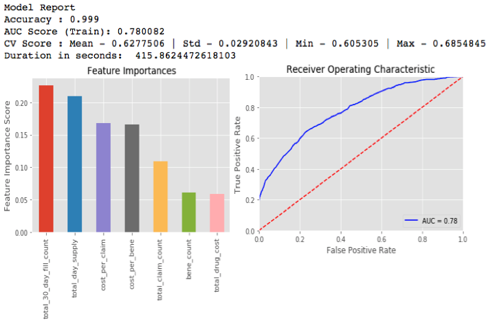
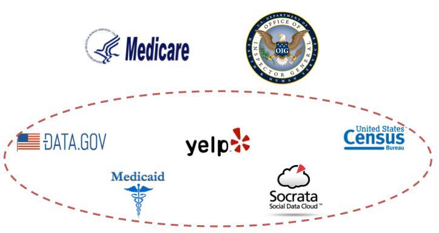

# Detecting Healthcare Fraud Using Machine Learning[¶](#Detecting-Healthcare-Fraud-Using-Machine-Learning)

Video Presentation - August 22, 2018

## 1\. Background and Motivation[¶](#1.-Background-and-Motivation)

The Institute of Medicine estimated that 30 percent of U.S. health spending (public and private) in 2009 — roughly `$750 billion — was wasted` on unnecessary services, excessive administrative costs, `fraud`, and other problems. And according to the 2016 Ernst and Young audit report of the US Department of Health and Human Services, HHS did not achieve an `improper payment rate` of less than `10 percent` for the Medicare Fee-for-Service and Medicaid programs. (sources: [Management Issue 5](https://oig.hhs.gov/reports-and-publications/top-challenges/2012/issue05.asp) and [2016 FY Audit Report](https://oig.hhs.gov/oas/reports/region17/171752000.asp))  

The primary motivation of this project is to explore the viability of using Machine Learning and Artificial Intelligence to detect potential fraud using publicly available data sources.

## 2\. Methodology and Technology Stack[¶](#2.-Methodology-and-Technology-Stack)

### Data Sources[¶](#Data-Sources)

* * *

#### 

Figure 1: Data Sources

There are plenty of data sources that can be incorporated into the Machine Learning model but given the time constraints, I decided to initially focus on:

> Drug Prescription Data from Medicare as **predictors**, and  
> List of Excluded Individuals and Entities as my **targets**.

The notebook containing the exploratory data analysis into these data sets can be found [here](notebooks/EDA.ipynb).

### Technology Stack[¶](#Technology-Stack)

* * *

#### 

Figure 2: Tech Stack

I used standard Python based Data Science tech stack. Also, given that I had large data set, I used a powerful EC2/Sagemaker instances on the AWS.

### Preserving the Signal[¶](#Preserving-the-Signal)

* * *

#### 

Figure 3: Imbalanced Classes

Generally, imbalanced classes are common in fraud detection. In other words, we'd expect to see far fewer fraudulent transactions relative to the non-fraudulent ones. In my case, the ratio is roughly 1-to-1000\.  

A common strategy to balance out the labels is to either undersample the majority class or oversample the minority target class. I chose the latter and I used Random Bootstrap Sampling and SMOTE. The implementation of the code can be found [here](src/over_sample.py).  

Since a large number of excluded healthcare providers didn't have a National Provider Identifier, I tried matching the records by name, specialty, and state using fuzzy-wuzzy. Over 25 million pairs were compared but the results didn't yield a significant contribution to address the `imbalanced classes` issue, so I didn't incorporate any of the resulting records into my model. You may still find the notebook with the implementation of fuzzy-wuzzy string matching [here](notebook/fuzzy-wuzzy.py).  

#### 

Figure 4: Exclusion Ratio by State

And finally, to maximize the presence of the target signal, i.e. the ratio of excluded providers relative to the total number of providers, I considered limiting the scope of the model only to the States with the highest exclusion ratios. The implementation of this strategy can be found in [this](notebook/exclusion_ratio.py) notebook.

## 3\. Model Results[¶](#3.-Model-Results)

* * *

#### 

Figure 5: Model Performance

Since my model had a significant class imbalance, to assess model performance I used Area Under the Curve (AUC). This is a common measure to evaluate the trade-off between correctly identifying the true signal relative to incorrectly identifying false signals as we increase the acceptance threshold.  

I initially ran the model through the `Random Forest` and the performance was:

> AUC score: 0.72  
> Cross Validation score (mean): 0.61

Next, I ran the model through other ensemble algorithms but the `Gradient Boosted Trees` came in first with:

> AUC score: 0.78  
> Cross Validation score (mean): 0.63

Also, the model picked up on these 2 features as most predictive:

> 30-day fill count  
> total day supply

And finally, the implementation of the model can be found in [this](notebook/model.py) notebook .

## 4\. Next Steps[¶](#4.-Next-Steps)

* * *

#### 

Figure 6: Next Steps

This is a very interestig topic. My next steps will include incorporating more data sets in the hope of driving up model performance.
